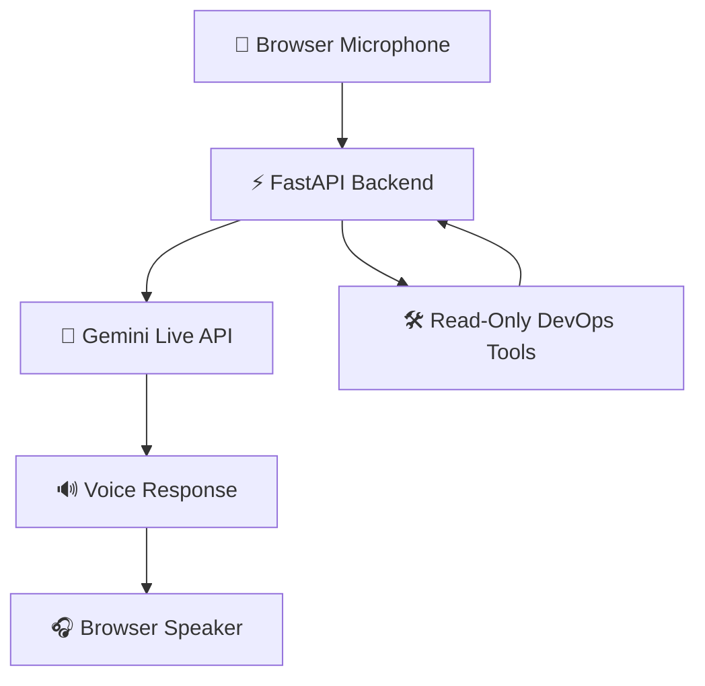
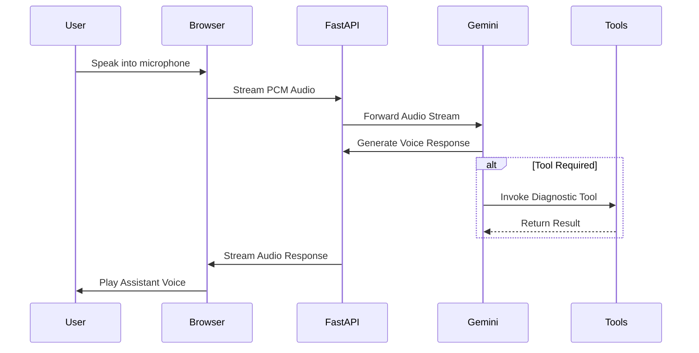

# 🎙️ DevOps Siri VoiceOps Assistant

A DevOps Siri-branded real-time AI voice assistant for DevOps learning, troubleshooting guidance, and safe local diagnostics.

The browser captures microphone audio and streams it over WebSocket to a FastAPI backend. The backend maintains a Gemini Live session, streams the assistant's voice back to the browser, and exposes a small set of read-only DevOps tools.

---

## 🚀 Features

✅ Real-time voice conversation with Gemini Live

✅ DevOps Siri-inspired frontend

✅ Linux troubleshooting guidance

✅ Docker concepts and diagnostics

✅ Kubernetes learning and troubleshooting

✅ Jenkins and CI/CD explanations

✅ Networking fundamentals

✅ Read-only system diagnostics

✅ Tool activity and transcript visibility

### Supported Diagnostics

- CPU usage
- Memory usage
- Disk usage
- TCP ports
- HTTP/HTTPS endpoint checks
- Docker container listing (optional)

---

## 📁 Project Structure

```text
DevOps-AI-Voice-Assistant/
│
├── app/
│   ├── __init__.py
│   ├── server.py
│   ├── persona.py
│   └── tools.py
│
├── frontend/
│   ├── index.html
│   ├── main.js
│   ├── pcm-processor.js
│   └── assets/
│
├── docs/
│   ├── ARCHITECTURE.md
│   ├── LOCAL_SETUP.md
│   ├── DOCKER_COMPOSE.md
│   └── TOOLS.md
│
├── Dockerfile
├── compose.yaml
├── compose.safe.yaml
├── pyproject.toml
├── uv.lock
├── requirements.txt
├── .python-version
├── .env.example
├── .gitignore
├── .dockerignore
├── run-local.sh
├── run-local.ps1
└── README.md
```

---

## 🏗️ Architecture

### High-Level Flow



### Detailed Request Flow



Detailed architecture documentation:

```text
docs/ARCHITECTURE.md
```

---

## ✅ Prerequisites

### Native Execution

- Python 3.11+
- Internet connection
- Gemini API Key
- Modern browser with microphone access
- uv (recommended)

### Docker Execution

- Docker Engine / Docker Desktop
- Docker Compose v2
- Internet connection
- Gemini API Key

No database, Kubernetes cluster, Node.js runtime, or cloud account is required.

---

## ⚙️ Configuration

Copy the environment template:

### Linux / macOS / WSL

```bash
cp .env.example .env
```

### Windows PowerShell

```powershell
Copy-Item .env.example .env
```

Configure your Gemini API key:

```env
GOOGLE_GENAI_USE_VERTEXAI=FALSE
GOOGLE_API_KEY=YOUR_GEMINI_API_KEY

LIVE_MODEL=gemini-3.8-live
LIVE_VOICE=Aoede

LOG_LEVEL=INFO
OTEL_SDK_DISABLED=true

DOCKER_SOCKET=/var/run/docker.sock
```

> ⚠️ Never commit `.env` files to source control.

---

# 🚀 Running the Application

## Option A: Run Using UV

Install dependencies:

```bash
uv sync --frozen
```

Start server:

```bash
uv run uvicorn app.server:app \
  --host 0.0.0.0 \
  --port 8000
```

Or:

```bash
./run-local.sh
```

Windows:

```powershell
.\run-local.ps1
```

Open:

```text
http://localhost:8000
```

Health Check:

```text
http://localhost:8000/api/health
```

---

## Option B: Python Virtual Environment

### Linux / macOS

```bash
python3 -m venv .venv

source .venv/bin/activate

python -m pip install -r requirements.txt

python -m uvicorn app.server:app \
  --host 0.0.0.0 \
  --port 8000
```

### Windows

```powershell
python -m venv .venv

.\.venv\Scripts\Activate.ps1

python -m pip install -r requirements.txt

python -m uvicorn app.server:app `
  --host 0.0.0.0 `
  --port 8000
```

---

## Option C: Docker Compose

Build and start:

```bash
docker compose up --build
```

Open:

```text
http://localhost:8000
```

Useful commands:

```bash
docker compose ps

docker compose logs -f voiceops

docker compose down
```

---

## 🔒 Safe Mode (Without Docker Socket)

Run:

```bash
docker compose -f compose.safe.yaml up --build
```

This disables
